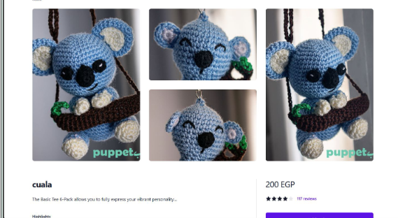

# Puppets E-Commerce Platform

This repository contains a full-stack e-commerce platform for selling puppets. It includes a React-based frontend and an Express.js backend, with MongoDB as the database. The platform supports product browsing, shopping cart functionality, order placement, and admin management.

---
## Video Demo

Check out the video demo of the platform in action:

[](https://github.com/user-attachments/assets/ab506a9c-fea6-40da-aded-135c072f2a1d)

---


## Table of Contents

1. [Features](#features)
2. [Technologies Used](#technologies-used)
3. [Folder Structure](#folder-structure)
4. [Setup and Installation](#setup-and-installation)
5. [Frontend Overview](#frontend-overview)
6. [Backend Overview](#backend-overview)
7. [API Endpoints](#api-endpoints)
8. [Development Workflow](#development-workflow)

---

## Features

- **Frontend**:
  - Product listing and detailed product views.
  - Shopping cart with add/remove functionality.
  - Checkout process with order summary.
  - Special request form for custom orders.
  - Admin dashboard for managing products and orders.

- **Backend**:
  - RESTful API for managing products, orders, and special requests.
  - MongoDB integration for data persistence.
  - Image upload functionality for products and special requests.

---

## Technologies Used

### Frontend
- **React**: Component-based UI development.
- **React Router**: For routing and navigation.
- **Tailwind CSS**: For responsive and modern styling.

### Backend
- **Express.js**: Backend framework.
- **MongoDB**: NoSQL database for storing data.
- **Multer**: For handling file uploads.
- **Cors**: For cross-origin resource sharing.

---

## Folder Structure

### `/client`
Contains the React frontend application.

```
client/
├── public/               # Static assets
├── src/                  # Source code
│   ├── components/       # React components
│   ├── context/          # Context API for state management
│   ├── pages/            # Page components
│   ├── App.jsx           # Main app component
│   ├── main.jsx          # Entry point
│   └── index.css         # Global styles
├── package.json          # Frontend dependencies
├── tailwind.config.js    # Tailwind CSS configuration
└── vite.config.js        # Vite configuration
```

### `/server`
Contains the Express.js backend application.

```
server/
├── db/                   # Database connection
├── routes/               # API routes
│   ├── record.js         # Product routes
│   ├── orders.js         # Order routes
│   └── specialRequest.js # Special request routes
├── server.js             # Main server file
├── config.env            # Environment variables
└── package.json          # Backend dependencies
```

---

## Setup and Installation

### Prerequisites
- Node.js (v16+)
- MongoDB (local or cloud instance)

### Steps

1. Clone the repository:
   ```bash
   git clone https://github.com/minaraafat21/puppets
   cd puppets
   ```

2. Install dependencies for both frontend and backend:
   ```bash
   cd client
   npm install
   cd ../server
   npm install
   ```

3. Configure environment variables:
   - Create a `.env` file in the `/server` directory.
   - Add the following variables:
     ```
     PORT=5050
     MONGO_URI=<your-mongodb-uri>
     ```

4. Start the backend server:
   ```bash
   cd server
   npm start
   ```

5. Start the frontend development server:
   ```bash
   cd client
   npm run dev
   ```

6. Open the application in your browser:
   ```
   http://localhost:5173
   ```

---

## Frontend Overview

### Key Components
- **`ProductView.jsx`**: Displays detailed product information.
- **`Cart.jsx`**: Manages the shopping cart.
- **`Checkout.jsx`**: Handles the checkout process.
- **`SpecialRequest.jsx`**: Form for submitting custom requests.
- **`AdminDashboard.jsx`**: Admin interface for managing products and orders.

### Styling
- Tailwind CSS is used for styling. Custom configurations are defined in `tailwind.config.js`.

---

## Backend Overview

### Key Routes
- **`/record`**: CRUD operations for products.
- **`/orders`**: Handles order creation and retrieval.
- **`/specialRequests`**: Manages special requests with image uploads.

### Database
- MongoDB is used to store products, orders, and special requests. The database connection is managed in `db/connection.js`.

---

## API Endpoints

### Products
- **GET** `/record`: Fetch all products.
- **POST** `/record`: Add a new product.
- **PATCH** `/record/:id`: Update a product.
- **DELETE** `/record/:id`: Delete a product.

### Orders
- **GET** `/orders`: Fetch all orders.
- **POST** `/orders`: Create a new order.

### Special Requests
- **GET** `/specialRequests`: Fetch all special requests.
- **POST** `/specialRequests`: Submit a new special request.

---

## Development Workflow


### Testing
- Cypress is set up for end-to-end testing. Run the following command to start Cypress:
  ```bash
  cd client
  npx cypress open
  ```

---

## Contact

For questions or feedback, please contact [mina.heinen2@gmail.com].
